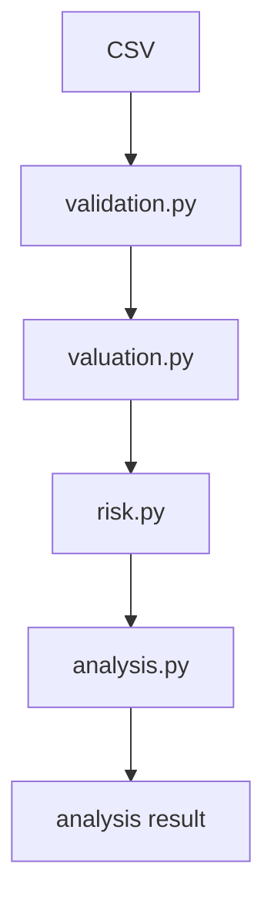

# Portfolio Risk X-Ray

A tested Python financial-engineering project for validating portfolio data, calculating market values and weights, monitoring concentration, and producing a transparent weighted-volatility exposure diagnostic.

Built around deterministic calculations, explicit assumptions and hand-checkable test fixtures.

Portfolio Risk X-Ray is a small, deliberately scoped analysis tool. It is not a complete institutional risk engine.

## At a glance

- Python 3.11+
- pandas for data loading and tabular calculations
- pytest, with 56 automated tests
- Deterministic portfolio valuation
- Strict financial-data validation
- Concentration monitoring
- Weighted volatility exposure
- Finance logic separated from presentation

## Design intent

This project explores how portfolio data moves from raw financial input through validation, valuation and risk analysis, using deterministic calculations that can be tested and checked by hand.

The goal is to make financial assumptions explicit rather than hide them behind a dashboard. Every number the application produces can be traced to a stated formula, a validated input and a passing test.

## Architecture



| Module | Responsibility |
|---|---|
| `validation.py` | Reads the CSV with pandas, normalises tickers and rejects invalid positions with `PortfolioDataError`. |
| `valuation.py` | Adds `market_value` and `weight`, and returns the total portfolio value. Rejects a zero or non-finite total. |
| `risk.py` | Flags concentrated positions, finds the largest position and calculates weighted volatility exposure. |
| `analysis.py` | Runs the steps above in order and returns one result. It contains no formulas of its own. |

DataFrame transformation functions return new DataFrames rather than mutating their inputs. Scalar and summary functions read from those derived results. Finance logic remains independent of presentation.

## Golden example

The repository includes a hand-calculable sample portfolio in [`data/sample_portfolio.csv`](data/sample_portfolio.csv). Volatility is stored in the CSV as a decimal fraction (1.8% is `0.018`).

| Ticker | Quantity | Price | Daily volatility | Market value | Weight |
|---|---:|---:|---:|---:|---:|
| AAPL | 100 | 400 | 1.8% | £40,000 | 40% |
| MSFT | 100 | 300 | 1.5% | £30,000 | 30% |
| TLT | 200 | 100 | 0.9% | £20,000 | 20% |
| CASH | 1 | 10,000 | 0.0% | £10,000 | 10% |
| **Total** | | | | **£100,000** | **100%** |

Running the full analysis:

```python
from portfolio_risk.analysis import analyse_portfolio

analysis = analyse_portfolio("data/sample_portfolio.csv")

analysis["total_portfolio_value"]         # 100000.0
analysis["largest_position"]              # {'ticker': 'AAPL', 'weight': 0.4}
analysis["weighted_volatility_exposure"]  # ≈ 0.0135 (1.35% per day)
analysis["concentration_threshold"]       # 0.25
analysis["positions"]                     # DataFrame with every per-position result
```

Prices are assumed to be in a single currency. The CSV has no currency column and V1 performs no FX conversion.

## Finance formulas

**Market value**

```text
market_value = quantity × price
```

What one position is worth: the number of units held multiplied by the price per unit.

**Portfolio weight**

```text
portfolio_weight = market_value ÷ total_portfolio_value
```

Each position's share of the whole portfolio. Weights sum to 1 (100%). The total is checked before division: a zero or non-finite total raises an error rather than producing meaningless weights.

**Weighted volatility component**

```text
weighted_volatility_component = weight × daily_volatility
```

A position's own daily volatility, scaled by how much of the portfolio it represents. A large, volatile position has a large component. Cash, with zero volatility, has a component of zero.

**Weighted volatility exposure**

```text
weighted_volatility_exposure = Σ(weighted_volatility_component)
```

A simple daily exposure indicator formed by weighting each position's stand-alone volatility by its portfolio weight and summing the results.

For the golden portfolio:

| Ticker | Calculation | Component |
|---|---|---:|
| AAPL | 0.40 × 0.018 | 0.0072 |
| MSFT | 0.30 × 0.015 | 0.0045 |
| TLT | 0.20 × 0.009 | 0.0018 |
| CASH | 0.10 × 0.000 | 0.0000 |
| **Exposure** | | **0.0135 (1.35% per day)** |

In floating-point arithmetic the computed sum is `0.013499999999999998`, so the tests compare it with `pytest.approx`.

## Concentration logic

```text
above_threshold = weight > concentration_threshold
```

A position is flagged when its weight is strictly greater than the threshold. **Equality does not trigger the flag**: a 40% position with a 40% threshold is not flagged.

The default threshold is **25%**. For the golden portfolio, AAPL (40%) and MSFT (30%) are flagged; TLT (20%) and CASH (10%) are not. The threshold must be between 0 and 1; anything else raises `ValueError`.

The largest position is the one with the greatest weight. If several positions tie, the first one in the file wins, so the result is deterministic.

## What this project intentionally does not claim

> **Weighted volatility exposure is a simple, transparent indicator. It is not a measure of portfolio risk in the statistical sense.**

Weighted volatility exposure is **not**:

- true portfolio volatility
- marginal risk contribution
- component risk contribution
- Value at Risk (VaR)
- expected loss

True portfolio volatility depends on how assets move together, which requires covariance or correlation information:

```text
σp = √(wᵀΣw)
```

- **w** is the vector of portfolio weights.
- **Σ** is the covariance matrix of asset returns.
- **σp** is the portfolio volatility.

Weighted volatility exposure ignores correlations entirely. For this long-only formulation, weighted volatility exposure matches covariance-based portfolio volatility only in the special case where all assets with non-zero volatility are perfectly positively correlated (+1). Assets with zero volatility, such as the CASH example, do not contribute to this condition. If any two assets with non-zero volatility are less than perfectly correlated, covariance-based portfolio volatility is lower, because diversification reduces risk, and this indicator does not capture that.

The sample CSV contains no return history and no correlations, so V1 cannot calculate true portfolio volatility. Covariance-based portfolio volatility is a possible future extension. It is not part of V1.

Volatility in V1 is also a daily figure. It is not annualised.

## Data quality principles

Bad financial data is never silently dropped, filled or repaired. Every portfolio input-data problem raises `PortfolioDataError` with a message naming the file line, the ticker and the offending value where practical, for example:

```text
quantity must be greater than 0 (V1 is long-only): line 3 AAPL (0.0)
daily_volatility must not exceed 1.0; enter 1.8% as 0.018: line 2 AAPL (1.8)
```

The loader deliberately rejects:

- missing tickers
- duplicate tickers after normalisation (whitespace is stripped and tickers are upper-cased, so `aapl`, ` AAPL ` and `Aapl` are the same ticker)
- zero or negative quantities (V1 is long-only)
- zero or negative prices
- missing, non-numeric or negative volatility
- daily volatility above 100% (`daily_volatility > 1.0`)
- missing or unexpected columns (the four required columns may appear in any order)
- malformed rows, including rows with more fields than the header
- blank rows inside the dataset
- empty files and missing files

Rejecting `daily_volatility > 1.0` is a deliberate V1 data-quality guardrail, not a mathematical limit: daily volatility above 100% is possible. The guardrail is designed in part to catch percentage-format mistakes, such as entering `1.8` instead of `0.018` for 1.8%, which would otherwise be accepted silently as 180% per day.

Zero volatility is allowed, which is how cash is represented. Cash is an ordinary position: the same formulas apply to it, with no special-case code.

## Testing

The project currently has **56 passing pytest tests**.

| Area | What is proven |
|---|---|
| Package and import | The package and pandas import correctly. |
| CSV validation | The golden CSV loads with the expected values and dtypes, and every rejection rule above raises `PortfolioDataError`. |
| Valuation | Golden market values are exactly £40,000, £30,000, £20,000 and £10,000, and the total is £100,000. Zero and non-finite totals are rejected. |
| Portfolio weights | Golden weights are 40%, 30%, 20% and 10% and sum to 1. Inputs are not mutated and row order is preserved. |
| Concentration | The 25% default flags only AAPL and MSFT, a 40% threshold does not flag AAPL, and invalid thresholds are rejected. |
| Weighted volatility exposure | Golden components match the hand calculation, the exposure is approximately 0.0135, and cash contributes zero. |
| End-to-end orchestration | `analyse_portfolio` returns the complete expected result, passes a custom threshold through, and preserves error behaviour. |

Run the tests from the repository root with the virtual environment activated:

```powershell
python -m pytest -v
```

## Installation

Windows (PowerShell), Python 3.11 or later:

```powershell
git clone https://github.com/AminQuantSystems/portfolio-risk-xray.git
cd portfolio-risk-xray
python -m venv .venv
.\.venv\Scripts\Activate.ps1
python -m pip install -e ".[dev]"
python -m pytest -v
```

If `python` is not on your PATH, use the Python launcher instead: `py -m venv .venv`.

The only runtime dependency is pandas. pytest is a development dependency.

## Repository structure

```text
portfolio-risk-xray/
├── data/
│   └── sample_portfolio.csv     # golden £100,000 portfolio
├── src/
│   └── portfolio_risk/
│       ├── __init__.py
│       ├── validation.py        # CSV loading and data-quality rules
│       ├── valuation.py         # market value, total value, weights
│       ├── risk.py              # concentration and weighted volatility exposure
│       └── analysis.py          # orchestration of the steps above
├── tests/
│   ├── conftest.py              # shared golden fixtures
│   ├── test_package_import.py
│   ├── test_validation.py
│   ├── test_valuation.py
│   ├── test_risk.py
│   └── test_analysis.py
├── README.md
└── pyproject.toml
```

## Roadmap

Planned:

- Risk X-Ray visual interface
- scenario stress testing
- covariance-based portfolio volatility
- historical return analysis
- drawdown metrics
- clearer portfolio-risk visualisation

Possible later research, not committed: Value at Risk, Monte Carlo simulation and portfolio optimisation.

## Engineering principles

- **Deterministic finance calculations.** The same input always produces the same output.
- **Explicit assumptions.** Units, sign conventions and threshold semantics are stated, not implied.
- **Separation of finance logic from presentation.** Calculations live in a tested library that any interface can call.
- **No silent financial-data repair.** Invalid data stops the analysis with a clear error.
- **Small tested modules.** Each module has one responsibility and its own test file.
- **Hand-checkable golden fixtures.** The sample portfolio is designed so every result can be verified with a calculator.
